# Beezel

Remote build caching for Lerna projects using Yarn workspaces.



- You should only build things that need to be built based on what has changed in a PR.
- You need to take into account dependencies.

**Examples following these principles:**

- If you make a change to `app` you should build `app`.
- If you make a change to `components` you should build `components`, `app`, and `other-app`.
- If you make a change to `utils` you should build `utils`, `components`, `app`, and `other-app`.
- In none of these examples should you need to build `other-other-app`, since it has no dependencies we changed, and we never changed it.

How do you accomplish not building things you have previously built if each CI run starts fresh? That is what "remote build caching" accomplishes. Artifacts from previous builds are stored on Amazon S3 so that we can download them and avoid building everything on each PR.

## Installation

Beezel caches `node_modules` and `packages/*/node_modules` for you, so its code must be accessible before running `yarn`.
To accomplish this you can use this script to put Beezel in your project. Beezel is distributed as a single file (`beezel`), which is a node script.

```bash
# Currently only works on macOS / Linux.
curl -L https://raw.githubusercontent.com/DylanVann/beezel/master/bin/install | node
```

You will need to commit the `beezel` file.

## Configuration

### Environment Variables

Use these environment variables to configure Beezel.

```bash
# Beezel needs credentials for AWS S3 access.
BEEZEL_AWS_ID="Your id."
BEEZEL_AWS_SECRET="Your secret."
BEEZEL_AWS_BUCKET="Your bucket name."
# This can be used to cache bust Beezel.
BEEZEL_CACHE_KEY="v2"
# This could speed up S3.
AWS_NODEJS_CONNECTION_REUSE_ENABLED=1
```

### `globalDependencies`

**NOTE: Try to avoid using `globalDependencies`. Check the [Tips](##tips) section for more info.**

Depending on how your monorepo is setup you may have some files at the root of your project that need to be taken into account when determining what changed.

By default Beezel only takes into account changes to `yarn.lock`, which will cause a full rebuild.

You can list other `globalDependencies` in `package.json`, for example you may wish to do a full rebuild if `babel.config.js` changes:

```json
{
  "private": true,
  "workspaces": [
    "packages/*"
  ],
  "beezel": {
    "globalDependencies": [
      "babel.config.js",
      "yarn.lock"
    ]
  }
}
```

## Usage

```bash
# Run this to:
# - Run Yarn (with remote caching).
# - Build packages (with remote caching).
./beezel
```

## Tips

- Enable [S3 transfer acceleration](https://docs.aws.amazon.com/AmazonS3/latest/dev/transfer-acceleration.html) on your S3 bucket.
- Enable [Keep-Alive](https://docs.aws.amazon.com/sdk-for-javascript/v2/developer-guide/node-reusing-connections.html) for S3 by setting `AWS_NODEJS_CONNECTION_REUSE_ENABLED` to `1`.
- Instead of persisting to workspaces during a fan-out build (e.g. `persist_to_workspace` on CircleCI) you can run Beezel in each spawned container, this may be faster.
- You should remove any existing caching of `node_modules` on CI, since Beezel does this.
- Try not to use `globalDependencies` if possible.
  - Having scripts at the root of your repo, or using any sort of global configuration files goes against the idea of separating things into packages.
  - e.g. Instead of using `babel.config.js` at the root of your repo it would be better to create a `babel-preset-my-name` package and depend on that in other packages.
  - If you use normal packages and list dependencies in your `package.json` files Beezel and other tools can understand your repo automatically.
  - If you rely on other mechanisms like looking upwards in the file tree this is not possible.

## How it works?

Beezel operates on the package level.

The hash of a package depends on:

- A hash of the source files in the package.
  - Only takes into account files that are not gitignored.
- A hash taking into account internal dependencies.
  - e.g. A depends on B, then the hash for A will take into account the hash of B.
  - e.g. A depends on B, if B changes then A needs to be rebuilt.
- A hash taking into account global dependencies.
  - This takes into account your root `yarn.lock` file.
  - e.g. If `yarn.lock` changes everything must be rebuilt.
  - It can take into account any config files at the root of your repo.
  - This is configured by setting `beezel.globalDependencies`.

After a package is built an archive is created for it.
The archive will contain any gitignored files in the package folder.
The archive is uploaded to S3 with the cache key in the filename so that on the next build we can download this file instead of building from scratch.
